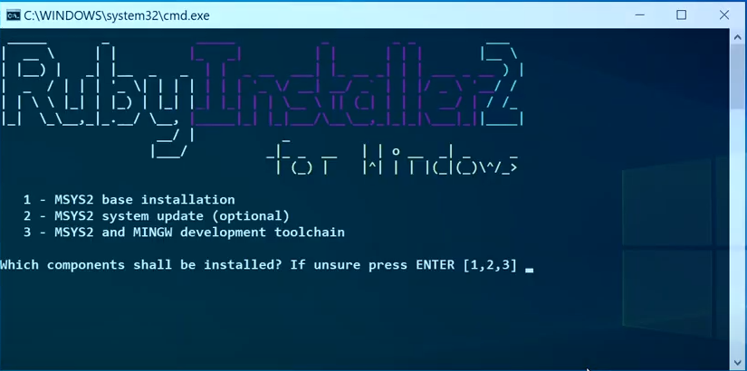

# Welcome to CONTRIBUTING.md

Hey there, fellow Developer !!!... I happy see, hyped about make your *, probably,* first contribution to this open source repo. I heartily welcome you to your journey in open source contribution. I hope you have fun learning and teaching at the same time. For the **Notebook**, most of the contribution done will be related to the content writing like blogs, tip & trick, tech update, various documentation, etc.

## Setting up Environment

Before you even start working on your content writing, make sure you've got the right environment installed to build the project locally... As this project based on Jekyll[^1] framework that is built upon `Ruby`. We need `Ruby`, `Bundler` and `jekyll` framework to build and test within local systems. The installation process is different from platform to platform, so make sure you following the instruction properly.

### For Ubuntu:

If you're using a Linux distribution - **Ubuntu**, then follow these steps:

- Install the `Ruby` and other prerequisites using the following command:
```bash
sudo apt-get install ruby-full build-essential zlib1g-dev -y
```
> [!NOTE]
> Avoid installing RubyGems packages (called gems) as the root user. Instead, set up a gem installation directory for your user account. The following commands will add environment variables to your `~/.bashrc`{: .file-path} file to configure the gem installation path:
```bash
echo '# Install Ruby Gems to ~/gems' >> ~/.bashrc
echo 'export GEM_HOME="$HOME/gems"' >> ~/.bashrc
echo 'export PATH="$HOME/gems/bin:$PATH"' >> ~/.bashrc
source ~/.bashrc
```


- Now use the following command, to check whether `Ruby` has properly installed and its PATH has been set properly.
```bash
ruby -v
```

- Finally, install Jekyll and Bundler:
```bash
gem install jekyll bundler
```

> [!IMPORTANT]  
> For Other Linux Distros, check the offical [Jekyll](https://jekyllrb.com/docs/installation/other-linux/ "visit offical jekyll page for other linux installation") webpage. Also make sure, you have installed `bundler` along with jekyll using the follow command:
```bash
gem install bundler
```

- Use the following command to check whether the `bundler` and jekyll framework installed properly or not.
```bash
bundle info --path jekyll-theme-chirpy
```

- Now, your system is ready to build and use the project locally.

### For Windows:

For Windows users, setting up the environment is a bit more involved:

- Start by downloading and installing the the `Ruby` using [RubyInstaller](https://rubyinstaller.org/downloads/ "Download RubyInstaller"), choose the the latest one with Devkit with default options.

- At the end of installation, You'll get CMD asking you to enter option between 1-3. Enter 3 as input, then you can enter 2 if you want to update `MYSYS2` but that's totally optional. After all the installation is done, press enter to close the CMD prompt.

<div align="center">



</div>

- Open a new command prompt window from the start menu, Use the following command to check whether `Ruby` has properly installed and its `PATH`` has been set properly.
```powershell
ruby -v
```

- Now use the following command to install `Jekyll` and `Bundler`:
```powershell
gem install jekyll bundler
```

- Use the following command to check whether the `bundler` and jekyll framework installed properly or not.
```bash
bundle info --path jekyll-theme-chirpy
```

- Now, your system is ready to build and use the project locally.

### For MacOS:

If you're on MacOS, follow these steps:

> [!ALERT]
> Ensure you have the [Homebrew](https://brew.sh/ "Install Homebrew") package manager installed. If you're facing any issues while setting up the project in MacOS, check out the [Trobleshooting post](https://github.com/Grow-with-Open-Source/Notebook/discussions/3#discussioncomment-7151280) within the [Help Request](https://github.com/Grow-with-Open-Source/Notebook/discussions/3 "Goto Help Request Discussion") discussion.

- Start by install `chruby` and `ruby-install` with Homebrew:
```bash
brew install chruby ruby-install xz
```

- Install the latest stable version of `Ruby` _(supported by Jekyll[^jekyll-offical-website])_:
```bash
ruby-install ruby 3.1.3
```

- This will take a few minutes, and once it’s done, configure your shell to automatically use chruby:
```bash
echo "source $(brew --prefix)/opt/chruby/share/chruby/chruby.sh" >> ~/.zshrc
echo "source $(brew --prefix)/opt/chruby/share/chruby/auto.sh" >> ~/.zshrc
echo "chruby ruby-3.1.3" >> ~/.zshrc # run 'chruby' to see actual version
```
> [!NOTE]
> If you’re using Bash, replace `.zshrc` with `.bash_profile`. If you’re not sure, read this external guide to [find out which shell you’re using](https://www.moncefbelyamani.com/which-shell-am-i-using-how-can-i-switch/ "find you shell").

- Quit and relaunch Terminal, then check that everything is working:
```bash
ruby -v
```

- After installing Ruby with chruby, install the latest Jekyll & bundler gem:
```bash
gem install bundler jekyll
```

- Use the following command to check whether the `bundler` and jekyll framework installed properly or not.
```bash
bundle info --path jekyll-theme-chirpy
```

- Now, your system is ready to build and use the project locally.

## Build the project Locally

After setting up the environment, you can start contributing to the project:

- Start by [forking](https://github.com/Grow-with-Open-Source/Notebook/fork "let's fork the repo") the repository.

- Clone the forked repository to your local machine.
```bash
#cloning the repo
git clone https://github.com/<your-github-user-name>/Notebook.git

#entering the project directory
cd Notebook
```

- Use the following command to install project dependencies.
```bash
bundle
```

- Host the static website locally using the following command to preview the current state of the project.
```bash
bundle exec jekyll s
```

> [!NOTE]
> Use `--incremental` argument to update the project live while working on it...
```bash
bundler exec jekyll s --incremental
```

- If project build is successful, then you can view the project build that is hosted through your [localhost:4000/Notebook](http://127.0.0.1:4000/Notebook/). Well done, you have successfully setted up the project within your local system.

## Getting Started with Contribution

Now that you setted up the environment required and started analyzing the project, you have to know a few things about the project structure and its configuration before you started working on you content writing.

### Instructions and Guidelines

- All of the content writing will be done in Markdown *(`.md`)* file format. So, Make yourself more comfortable Markdown sytnax through [Offical GitHub Documentation](https://docs.github.com/en/get-started/writing-on-github/getting-started-with-writing-and-formatting-on-github/quickstart-for-writing-on-github "visit the offical GitHub Docs").

- Since this open source is based chripy[^2] theme jekyll[^1] project, You're not limited by Markdown only. You can do much more using simple Markdown that provides easy of writing while supporting limited HTML elements. Check out the Chirpy-based [post creation](https://chirpy.cotes.page/posts/write-a-new-post/) and [text and typography](https://chirpy.cotes.page/posts/text-and-typography/) posts to know more.

- You need to add you details to link the author details with the posts. You can add your author details to the **`_data/authors.yml`** file in the following format:
```yaml
# Make sure the key_value is unique and not to be a duplicate
unique_key_value:
    name: <author_name>
    twitter: <twitter_id>
    url: <personal (or) contact url>
```

<details>
<summary>Looking for an example ?</summary>
<div>

```yml
shamith_watchdogs:
  name: Shamith Nakka
  twitter: Shamith29188225
  url: https://github.com/iamwatchdogs/
```

<div>
</details>

- It is highly recommended to use the images though CDN links. But if for some reason you unable to do so, then store them in a new folder that is named after your post and save that folder within **`assets/img`** directory as **`assets/img/<your-project-name>/`**. Try avoid the process of *storing images within `assets/img` directory as it reflects the size of project.

- Place your content writing files within the **`_posts`** directory, following the naming convention **`YYYY-MM-DD-file-name.md`**, e.g., `2023-09-27-welcome-to-notebook.md`. **Use lowercase letters and separate words with a single dash.**

- Each and every content writing files should contain the following meta-data *(or)* configuration for the project to be successfully build:
```md
---
title: <title>
date: YYYY-MM-DD HH:MM:SS +/-TTTT
categories: [<main_categories>, <sub_categories_1>, ..., <sub_categories_n>]
tags: [<tag_1>, ..., <tag_n>]
author: <respective_author_key_value>
img_path: "/assets/img/<your_img_directory_name>/" <!--(or) respective CDN link -->
image:
  path: <name_of_the_img_for_page_cover>
  alt: <alternative_text>
---

# Your content writing begins here
```

<details>
<summary>Looking for an example ?</summary>
<div>

```md
---
title: Welcome to the Notebook
date: 2023-09-21 20:34:00 +0530
categories: [Welcome, Guide]
tags: [introduction]
author: shamith_watchdogs
img_path: "/assets/img/welcome-page/"
image:
  path: "welcome-img.jpg"
  alt: "Welcome Page"
---
```

<div>
</details>

> [!IMPORTANT]
> - Note that the `+/-TTTT` in the `date` section refers the **UTC offset**. You can find your **UTC offset** value by searching for your country in the [list of UTC](https://en.wikipedia.org/wiki/List_of_UTC_offsets "Goto List of UTC offsets"). And if you're from India, you can use the above UTC offset from the example.
> - If there are more that one person/author working on a single post, then use `authors` attribute instread of `author`. Also the input for the `authors` attribute will be a list of unique_key_value represnting the authors.
> - It's complete optional to have `img_path` and `image` attribute. Use them if and only if, your post requires any images.
> - If your post is using images and you have set the `img_path`, then you can directly access the images just by using their name.
> - The `image` attribute will act as the page cover or thumbnail for your post. It's up to you to add a page-cover or not.

These are the important instruction and guidelines you need follow for creating a successful post without any issue.

### Contributing

Now that you have basic understanding about the working of the project, let's talk a bit about process of contributing...

**Step 1:** You start you setting up the environment [*(as discussed above)*](#setting-up-environment).

**Step 2:** After setting up the required environment, now build the project locally [*(as discussed above)*](#build-the-project-locally).

**Step 3:** Create a new branch to work on you contribution. use the following command:
```bash
# create and check out to new branch
git checkout -b <simple-relavent-branch-name>

# check your branch currently in
git branch
```

**Step 4:** Now that you got the project up and running within you local machine, start by adding your details as author to [`_data/authors.yml`](_data/authors.yml) file as [mention above](#instructions-and-guidelines). Make sure you author key is unique and different from others.

**Step 5:** Now go ahead and create a new markdown file to work on post to contribute. Make sure you follow the naming convension for the file which is `YYYY-MM-DD-your-post-name`. And you post name should be all small alphanumeric separated by dashs *(-)*.

**Step 6:** Make sure you commit every change it now, one commit for adding the author name and one for creating a new markdown file. Using the following command:
```bash
# Adding or staging the changes
git add .

# commiting the changes
git commit -m "<related-short-message>
```

> [!IMPORTANT]
> Make sure to commit your each and every change with proper description

- **Step 7:** After creating the empty mark down file, add the required meta data *(or)* configuration as [mention above](#instructions-and-guidelines).

- **Step 8:** Now, proceed with your content writing using markdown syntax and also using additional features of Chirpy theme[^2].

- **Step 9:** If you have any images, try adding CDN links to the source containing all the images. If not, you can create a new directory using you posts name *(separated with dashes -)* within the `assets/img/` as `assets/img/<your-post-name>`. And also mention the CDN or directory path in `img_path` attribute as [mention above](#instructions-and-guidelines).

- **Step 10 (optional):** After you done with you post *(don't forget to come each and every change)*, if you want you can add an page-cover (or) thumbnail to you post. Just mention the image name within the sub attribute `path` of the main attribute `image`.

- **Step 11:** After commit all the changes and completion of your work. push your commit to you forked repo, using the following commands:
```bash
# check your branch name
git branch

# push your commit to origin repo
git push origin <your-branch-name>
```

- **Step 12:** Now, create a pull request to the [original repo](https://github.com/Grow-with-Open-Source/Notebook). [Learn about Pull requests](https://docs.github.com/articles/using-pull-requests "offical GitHub documentaiton")

And that it, you have done it !!!... Now, it's time for the maintainer to review you work and merge you pull request. If there's any issue with your pull request, then the maintainer will contact you and asks for a few changes. And he merges your Pull request, you have successfully did your first open source contribution that actual help others.

Everybody can see you work and make use of it. Good job, mate !!...

## Rules and Regulations

Here are some ground rules that you need to follow:

- It's important for you to commit each and every change. Don't just finish all of your work with a single commit. If you're a newbie, it will only be tolerated for 3 times.
- Sending several pull request for a single post is not accepted.
- Your Pull Request will not be merged, if you have modified, changed or deleted any files or content that doesn't belong to you.
- Pull Request containing any illegal, NFSW or any other content which doesn't help other in anyway possible will be close immediately.
- The Pull Request will only be merged if you everything seem to be in order. You be notified if you did something wrong, and you pull request will only be merged if the notified changes are made.


[^1]: **GitHub's Jekyll Framework offical Page:** <https://jekyllrb.com>
[^2]: **Chirpy Jekyll theme's Offical Repo:** <https://github.com/cotes2020/jekyll-theme-chirpy>